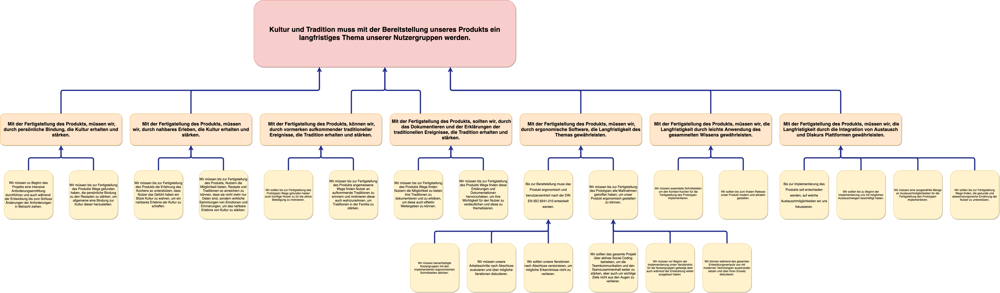

# Kultur und Tradition muss mit der Bereitstellung unseres Produkts ein langfristiges Thema unserer Nutzergruppen werden.
## Mit der Fertigstellung des Produkts, müssen wir, durch persönliche Bindung, die Kultur erhalten und stärken.
* Wir müssen zu Beginn des Projekts eine intensive Anforderungsermittlung durchführen und auch während der Entwicklung bis zum Schluss Änderungen der Anforderungen in Betracht ziehen.
* Wir müssen bis zur Fertigstellung des Produkts Wege gefunden haben, die persönliche Bindung zu den Rezepten zu stärken, um allgemeine eine Bindung zur Kultur dieser herzustellen.
##  Mit der Fertigstellung des Produkts, müssen wir, durch nahbares Erleben, die Kultur erhalten und stärken.
* Wir müssen bis zur Fertigstellung des Produkts die Erfahrung des Kochens so unterstützen, dass Nutzer das Gefühl haben ein Stück Kultur zu wahren, um ein nahbares Erlebnis der Kultur zu schaffen.
* Wir müssen bis zur Fertigstellung des Produkts, Nutzern die Möglichkeit bieten, Rezepte und Traditionen so anreichern zu können, dass sie nicht mehr nur Daten sind, sondern wirkliche Sammlungen von Emotionen und Erinnerungen, um das nahbare Erlebnis von Kultur zu stärken.
##  Mit der Fertigstellung des Produkts, können wir, durch vormerken aufkommender traditioneller Ereignisse, die Tradition erhalten und stärken.
* Wir sollten bis zur Fertigstellung des Prototypen Wege gefunden haben auch künftige Nutzer zu für die aktive Beteiligung zu motivieren.
* Wir müssen bis zur Fertigstellung des Produkts angemessene Wege finden Nutzer an aufkommende Traditionen zu erinnern und motivieren diese auch wahrzunehmen, um Traditionen in der Familie zu stärken.
##  Mit der Fertigstellung des Produkts, sollten wir, durch das Dokumentieren und der Erklärungen der traditionellen Ereignisse, die Tradition erhalten und stärken.
* Wir müssen bis zur Fertigstellung des Produkts Wege finden Nutzern die Möglichkeit zu bieten ihre Traditionen zu dokumentieren und zu erklären, um diese auch effektiv Weitergeben zu können.
* Wir müssen bis zur Fertigstellung des Produkts Wege finden diese Erklärungen und Dokumentationen hervorzuheben, um ihre Wichtigkeit für den Nutzer zu verdeutlichen und diese zu thematisieren.
## Mit der Fertigstellung des Produkts, müssen wir, durch ergonomische Software, die Langfristigkeit des Themas gewährleisten.
### Bis zur Bereitstellung muss das Produkt ergonomisch und benutzerzentriert nach der DIN EN ISO 9241-210 entwickelt werden.
* Wir müssen benachteiligte Nutzergruppen mit den implementierten ergonomischen Schnittstellen abholen.
* Wir müssen unsere Arbeitsschritte nach Abschluss evaluieren und über mögliche Iterationen diskutieren.
* Wir sollten unsere Iterationen nach Abschluss versionieren, um mögliche Erkenntnisse nicht zu verlieren.
### Wir müssen bis zur Fertigstellung des Prototypen alle Maßnahmen getroffen haben, um unser Produkt ergonomisch gestalten zu können.
* Wir sollten das gesamte Projekt über aktives Social Coding betreiben, um die Teamkommunikation und den Teamzusammenhalt weiter zu stärken, aber auch um wichtige Ziele nicht aus den Augen zu verlieren.
* Wir müssen vor Beginn der Implementierung unser Verständnis für die Nutzergruppen gefestigt aber auch während der Entwicklung weiter ausgebaut haben.
* Wir können während des gesamten Entwicklungsverlaufs uns mit modernen Technologien auseinander setzen und über ihren Einsatz diskutieren.
##   Mit der Fertigstellung des Produkts, müssen wir, die Langfristigkeit durch leichte Anwendung des gesammelten Wissens gewährleisten.
* Wir müssen essentielle Schnittstellen um den Kontext Kochen für die Fertigstellung des Prototypen implementieren.
* Wir sollten bis zum finalen Release unser Produkt modern und attraktiv gestalten.
##  Mit der Fertigstellung des Produkts, müssen wir, die Langfristigkeit durch die Integration von Austausch und Diskurs Plattformen gewährleisten.
* Bis zur Implementierung des Produkts soll entschieden werden, auf welche Austauschmöglichkeiten wir uns fokussieren.
* Wir sollten bis zu Beginn der Implementierung uns mit möglichen Austauschwegen beschäftigt haben.
* Wir müssen eine ausgewählte Menge an Austauschmöglichkeiten für die Fertigstellung des Prototypen implementieren.
* Wir sollten bis zur Fertigstellung Wege finden, die gesunde und abwechslungsreiche Ernährung der Nutzer zu unterstützen.

