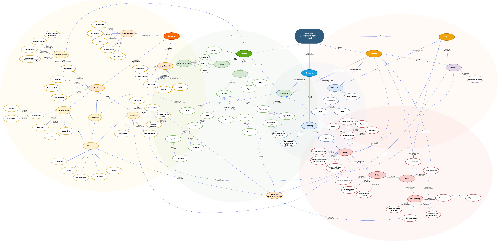

EPWS2020CobanMai   
    
# Traditions- und Kultur Sharing am Beispiel:    Generationsübergreifendes Kochen

## Was ist unser Problemraum?
### Domänenmodell des Problemraums

### Problemraum
#### Szenario
Viele traditionelle oder familiäre Rezepte fallen zurzeit immer weiter in Vergessenheit. 
Dies fällt meistens erst dann auf, wenn beim Besuchen der älteren Generation zum Beispiel eine Kaltschale zubereitet bekommt. Die ältere Generation sollte wieder mehr wertgeschätzt und ein wichtiger Teil der familiären Kochkultur werden. Auch wenn das Kochbuch aufgeschlagen und mit den angegebenen Zutaten ein Gericht nachgekocht wird, schmeckt es jedoch nicht so wie es aus der Kindheit bekannt ist. Es fehlt der Geheimtipp für den richtigen Geschmack. Ältere Generationen kennen verschiedene Rezepte, die aus der eigenen Kultur und Tradition stammen. Ein Beispiel dafür wäre die Nutzung heimischer Kräuter. 
Gemeinsames Essen ist ein alltägliches Ritual, das Fundament der kulturellen Identität und Kontinuität der Gemeinschaften, weil es hierbei zu einem sozialen Austausch und einer Kommunikation kommt. Durch den Austausch der Rezepte, angereichert durch die Kommentare erfahrener Köche, würde auch die Beziehung zwischen den Generationen gestärkt werden, weil dies letztendlich zu einer verstärkten Verbundenheit führt.
[1](https://vanierinstitute.ca/eating-culture-family-meal/)
Heutzutage gibt es öfter das Problem, dass die Kinder übergewichtig sind. Um diese gefährliche Tendenz umzukehren, müssen bewusste soziale Anstrengungen unternommen werden, damit die Verbindung zwischen Menschen, Natur, Kultur und Traditionen erhalten bleiben. Auf praktischer Ebene bedeutet dies, die Familie zurück in die Küche zu bringen. Es bedeutet, gemeinsam Mahlzeiten zuzubereiten, das Essen und die Gesellschaft des anderen am Tisch zu genießen. (https://thriveglobal.com/stories/why-i-have-decided-to-share-my-family-recipes/)
Zunächst ist der Esstisch ein wichtiger Ort für die Sozialisation von Kindern. Das Familienessen ist ein erstklassiger Rahmen für die Einführung in die Regeln und Normen des akzeptierten Verhaltens sowie in die Werte und Erwartungen der Familie.
Während der Mahlzeiten in der Familie lernen die Kinder Entwicklungsfähigkeiten und entwickeln Sprach-, Lese- und Schreibfähigkeiten im Gesprächsfluss. Insbesondere für kleine Kinder kann „Tischgespräch“ die Hauptquelle für die Auseinandersetzung mit Familiengesprächen und den Ausdruck von Gedanken, Ideen und Emotionen sein. (https://vanierinstitute.ca/eating-culture-family-meal/)
Es ist nicht zu vernachlässigen, dass die Globalisierung negative Auswirkungen auf Kultur und Gesellschaft hat. In dieser globalisierten Welt sind die bereichernden kulturellen Unterschiede und Besonderheiten, die eine Gesellschaft einzigartig machen, nicht mehr zu finden. Die Identität und die Einzigartigkeit, die einen Menschen besonders machen und von der Masse abhebt, gehen verloren. (https://www.moroccoworldnews.com/2011/10/12895/how-has-globalization-caused-a-loss-of-culture/)
Letztlich ist das Kochen ein sehr wichtiger Bestandteil der Identität, der Wurzeln, der Traditionen und des Erbes. Es vereint Familien, schafft Räume, um Geschichten zu verbinden und zu teilen. Das Weitergeben der Rezepte kann auch eine schöne, warme Art sein, sich an die Verstorbenen zu erinnern.
(https://www.quepasafoods.com/en-ca/passing-family-recipes/)

#### Recherche Ergebnisse
Bisher war es nötig das Familien ihre Rezepte in handgeschrieben oder digitalen Dokumenten niederschreiben und diese Verwahren bis sie endweder kopiert oder weitergegeben werden. Gerade bei Familienzusammenführungen kann dieser Vorgang schnell unübersichtlich bleiben und erfordert viel Mühe und Hingabe. 
Es besteht offensichtliches Interesse in der Jugend und im Kindesalter Kontakt an der eigenen Kulturellenvergangenheit. So haben beispielsweise der Malteserbund mit ihrer Broschüre zu [Crossing Generations](https://www.malteserjugend.de/fileadmin/Files_sites/Malteserjugend/Malteserjugend/Publikationen/Broschuere_Crossing_Generation.pdf) und die Technische Hochschule Ostwestfalen-Lippe mit ihrem Artikel zu "[Großmutters Topf](https://www.th-owl.de/forschung/gruender-labor/gruendergeschichten/gruendung/detail/aus-grossmutters-topf-gemeinsam-essen-macht-mehr-spass/)" auf ihre Weise das Problem adressiert. Leider ist bisher das technische [Know-How](https://www.piqd.de/loesungen/wie-wir-technik-brucken-bauen-die-generationen-verbinden) bei der älteren Generation noch mangelhaft um die Nutzung bisheriger Lösungen von digitaler Pflege eines privaten Kochbuches ein unausweichliches Problem. Und [uneinheitliche Lösungen](https://www.organisation-mit-sabine.de/rezepte-sammeln-und-erstellen-mit-dem-smartphone-4-apps-im-test/) was dieses Betrifft, macht es Nutzern nicht einfacher.  Große Plattformen und Dienstleister zeugen mit ihren vordefinierten gefilterten Sammlungen von [Großelterns-](https://www.chefkoch.de/rs/s0/gro%C3%9Feltern/Rezepte.html), [Familien-](https://www.edeka.de/rezepte/genussthemen/familienrezepte.jsp) und [Traditionsrezepten](https://www.chefkoch.de/magazin/artikel/6338/Chefkoch/fast-vergessene-rezepte-und-alte-schaetze.html#main_38680_6) dass es hier Nutzeranfragen gab und diese somit vorerst über die bereitgestellten Sammlungen befriedigt wurden.  
**Aus den Ergebnissen folgt, dass hier ein Bedürfnis für eine zufriedenstellendernde Lösung gibt.**
> Ergänzung folgt (Existenz und Beschreibung werden durch Quellen begründet - Was soll warum behandelt werden)

### Begriff Definition
> Folgt (Domänen erklären und ihre Relevanz für das Projekt beschreiben)

## Unsere Vision?
### Die Idee und das Ziel
Der Mehrwert ist die nachhaltige Speicherung und Verwahrung von Wissen, der erleichterte Austausch und die einfache Nutzung und Anwendung des Wissens.
Durch das Nacherleben des Wissens entwickelt sich eine persönliche Bindung, bei der die Verantwortung getragen wird, dieses Wissen zu wahren. 
Das Wissen zu dem bestimmten Thema sollte an einem Ort gebündelt werden, um nicht verschiedene physische Bücher aufzubewahren, welche auch verloren oder zerstört werden könnten.
Das Erreichen des Mehrwertes ist der Wille zum Nachkochen der Rezepte, weil beispielsweise schon ein Erlebnis damit verbunden ist. Dieses Erlebnis fängt damit an, indem man beispielsweise als Kind von der älteren Generation bekocht wird.
Ein weiterer Grund des Nachkochens ist die Verbundenheit und Wertschätzung der älteren Generation, weil man in der Vergangenheit persönliche Gefühle bei diesen Rezepten entwickelt hat. 
Um diesen Mehrwert weiterhin zu erhalten, kann ein Projekt entwickelt werden, in der es um ein soziales Unternehmen geht. In der Kantine eines Unternehmens kann man die Rezepte von der älteren Generation nachkochen. Hierbei geht es darum, dass die Menschen aufgrund der Arbeit zu Hause weniger Zeit zum Kochen haben und trotzdem Gerichte aus der älteren Generation essen können und diese in der Zukunft nicht vergessen.
Die Kommunikation und der Austausch von Wissen über Kochen und die sichere und nachhaltige Verwahrung dessen ist technologieunabhängig.

### Und wie eigentlich genau?
> Disclaimer: Die genaue Umsetzung ist bisher nicht mit den Mentoren abgesprochen, daher sind sämtliche Angaben unverbindlich und nur der erste Lösungsvorschlag resultierend aus den oben beschriebenen Problemraum.

Ziel des Projekts ist es anhand von Prototypen und Forschung ein Produkt zu konzipieren, welches die Registrierung und dadurch auch Verifizierung des Nutzers benötigt um exklusive Gruppen, mit anderen Communitymitgliedern, baumartig aufzubauen und dann über die, von Nutzern individuell anpassbare, Anwendungslogik, die Rezepte aus verschiedenen Generationen geteilt zu bekommen. Jedes Rezept wird dem Autor zugeordnet und nur die exklusive Gruppe erhält Zugriff auf das Rezept. Diese sollen versehen sein mit verschiedensten Kommentaren die die Bindung zu dem Rezept und den Familienmitgliedern stärken soll. Wichtig ist, dass das Produkt generationsübergreifend Nutzbar ist und nicht einen bestimmten Wissensstand vorraussetzt der bekanntlich nicht von bestimmten Generationen erbracht werden kann. Das Produkt soll von diversen Standorten aus benutzt werden können und soll die, von den Nutzern bereitgestellten, Rezepte sicher verwahren und an Mitglieder der Gruppe verteilt werden. Eigene Rezepte sollen angelegt werden können und stehts vorschläge für das Ausfüllen der benötigten Formulare, für die einheitliche Verteilung des Rezepts, angeboten werden. Das Eingetragne/Hinzugefügte/Erstellte soll wenn möglich nur gering eingeschränkt werden (Einschränkung nur wenn System relevant).
> Ergänzungen folgen (Grundlage für Evaluation und Einschätzung der Zielerreichung)

  **Mögliche Erweiterungen der Grundidee sind:**
- Anleitung über Videotutorial
- Abwandlungen des ursprünglichen Rezepts mit Verweis auf das Original sichern (Beispiel git)
- Druckvorlagen bereitstellen
- Teilen mit nicht-Gruppenmitgliedern (import / export)
- Das Familienkochbuch komplett drucken
- Favorisieren von Rezepten -> Bald Kochen Liste
- Verfügbarkeit der Zutaten -> Bestellbar über -> Verknüpfung mit einem externen Service
- Kochplan -> Einkaufsliste -> Erleichterter Bestellprozess
- Suche mit Filtermaske (Filteroptionen bitte dem Modell entnehmen)
- Personalisierbarkeit der Visualisierung des Rezepts und Kochbuch (Sammlung der Gruppenrezepte)
- Geschichten der Familie (Andenken an beispielsweise Feiertage)
- Vorratskammer (Was sollte man immer zu Hause haben)
- Einheiten-Umrechner
- Portionen-Umrechner
- Übersetzen des Rezepts in andere Sprachen
- Anleitung vorlesen lassen (pausieren, stoppen, abspielen, überspringen, zurückspringen)

## Warum ist dieses Projekt relevant?
### 1. Gesellschaftliche Relevanz
Das Kultur- und Traditions Sharing von generationsübergreifendem Kochen wird in der Praxis **aktuell mangelhaft** praktiziert.
Mit unserem Produkt wollen wir wieder **mehr Kommunikation** zwischen den Generationen innerhalb der Familie stärken. Die **Weitergabe und Austausch** von Wissen und seine Nutzung sind eine Bedienung dafür, dass Kulturen und Gesellschaften entstehen und bestehen bleiben.
Dieses Produkt unterstützt die Befriedigung individueller Neugier, persönliche Bildung und Horizonterweiterung. 
Es soll wieder eine **Verbindung** wieder zwischen den einfachen Texten und Bildern und der eigenen Vergangheit hergestellt werden. Daher wird der von uns bereitgestellte Dienst die **Zukunft von Tradition und Kultur** weitgehend sichern, sofern er aktiv von der Community genutz und gefüllt wird. Ein gesellschaftliches Umdenken, wenn auch nur Andersdenken, zur eigenen Ernährung und Planung von sozialen Treffen der Familie ist unser Hauptziel. Durch kulturellen Austausch wachsen Gemeinsamkeiten und Verständnis gegenüber anderen Kulturen, die helfen können Konfliktpotentiale zu verringern und Kompromisse zu erarbeiten. 
  Aus dem Kreis der Ehrenamtlichen für die Flüchtlingsbetreuung wurde tatsächlich auch schon berichtet, dass hier der Wunsch nach kulturellen Austausch zwischen Helfern und Flüchtlingen besteht. Die Gemeinschaft dort würde sich darüber freuen einen bequemen Weg zu finden, Rezepte und die gewissen Feinheiten der Zubereitung untereinander auszutauschen. Der traditionelle Weg über Papier - sei etwas umständlich. Auch wenn das nicht die angepeilte Nutzungsweise des Produkts wäre, so besteht kein Zweifel darin, dass das Produkt auch diese Nutzergruppe zufrieden stellen würde.
> Ergänzung folgt (unzureichende Begründung, da unser Hauptgrund #ökosoziale Transformation)

### 2. Wirtschaftliche Relevanz
Tatsächlich ist uns bei der Recherche nach bisherigen Produken, die unseren Problemraum adressieren, aufgefallen, dass es wenig, bis keine Konkurrenz gibt und wir somit eine ziemlich deutliche Marktlücke aufgedeckt haben. In unserem Bekanntenkreis besteht ein großes Interesse daran, Rezepte **exklusiv** mit der **eigenen Familie** zu teilen und trotzdem in der Verfügung über die eigenen Rezepte **nicht eingeschränkt** zu sein. Ob tatsächlich auch die Allgemeinheit ein Interesse an dem Produkt hat, lässt sich wohl nur durch weitere Forschung und Umfragen feststellen. Wir wünschen uns, dass wir den Dienst möglichst **kostengering** und für die Allgemeinheit anbieten können, dabei würden wir gerne auf störende Werbeanzeigen verzichten. Sollte dies möglich sein, würden somit eine innovative Geschäftsidee unterstützen, an welcher sich andere Dienste orientieren könnten. Für eine **bessere und sozialere Welt** in der das Wohl vor dem maximieren von Ertrag steht. Sollte es sich herausstellen, dass wir im Irrtum über die Tragbarkeit eines solchen Geschäftsmodells liegen, ziehen wir diese Aussage zurück. 

#### Beispiele für bisherige Konkurrenzprodukte
- [Recipe Keeper](https://play.google.com/store/apps/details?id=com.tudorspan.recipekeeper)   Lokales Speichern von selbst angelegten, importierten, gescannten Rezepten

- [My Cookbook](https://play.google.com/store/apps/details?id=com.aduilio.recipes)   Lokales Speichern von Rezepten

- [Cookpad](https://apps.apple.com/de/app/cookpad-rezepte-teilen/id585332633)   Community teilt öffentlich Rezepte und bietet das teilen von Rezepten mit anderen Communitymitgliedern

- [Cooking Cloud](https://play.google.com/store/apps/details?id=com.cookingcloud.app&hl=de)   Sammeln von externen Rezepten und das Teilen mit der Community

- [Kitchen Stories Rezepte](https://apps.apple.com/de/app/kitchen-stories-rezepte/id771068291)   Videoaufnahmen von Kochprozess mit der Community teilen

### 3. Wissenschaftliche Relevanz
Durch die Nutzung **state-of-the-art Technologie**, wie Progressive-Web-Applikationen (kurz PWA), werden wir diese weiter **voran treiben**. Es ist abzusehen, dass auch in Zukunft weitere Plattformen und Dienste im Web, PWA's in ihr Repertoire aufnehmen werden. Bekannte Beispiele für PWA's sind beispielsweise Instagram und Twitter, welche auch im mobilen Browser sich wie eine vanilla App verhalten, inklusive Animationen und übergänge. Diese lassen sich einfach über das Browsermenu zu dem Startbildschirm des Nutzers hinzufügen, ab da ist der **Unterschied kaum** noch zu bemerken.
  Hier bei ist zusätzlich zu beachten, das PWA's leichter instand zu halten sind, da man nur einen Quellcode modifizieren muss und das Update mit dem nächsten Cacheleeren des Nutzers oder durch explizite Befehle des Integrators auf die Geräte verteilt werden.
  Die Verteilung der gespeicherten Daten, welche ebenfalls empfehlenswert ist, seitens Wissenschaft, bietet den Vorteil, dass Daten mit **emotionalen Wert** nicht leicht verloren gehen können.
  Sämtliche Erfahrungen die wir bei der Konzipierung und Implementierung machen, werden dazu **beitragen**, dass diese Konzepte und Frameworks in Zukunft wahrscheinlich noch öfter genutzt werden.

### Autoren
- [Derya Coban](https://github.com/deryacbn), inf540, 11117424
- [Joel Maximilian Mai](https://github.com/Inf166), inf166, 11118561
