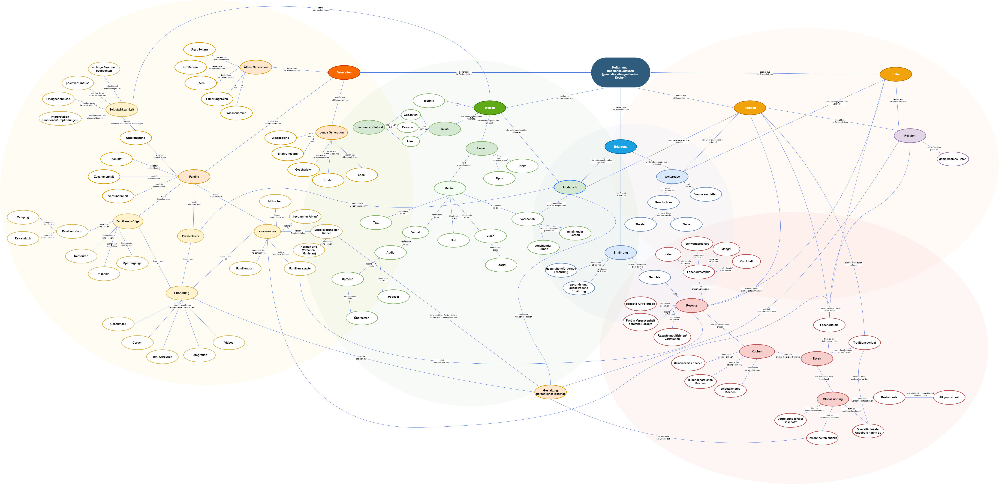

EPWS2020CobanMai   
    
# Traditions- und Kultur Sharing am Beispiel:    Generationsübergreifendes Kochen

## Was ist unser Problemraum?
### Domänenmodell des Problemraums

### Problemraum
Viele traditionelle oder familiäre Rezepte fallen zurzeit immer weiter in Vergessenheit. 
Das fällt meistens erst dann auf, wenn beim Besuchen der älteren Generation zum Beispiel eine Kaltschale zubereitet bekommt. Die ältere Generation sollte wieder mehr wertgeschätzt und ein wichtiger Teil der familiären Kochkultur werden.   Auch wenn das Kochbuch aufgeschlagen und mit den angegebenen Zutaten ein Gericht nachgekocht wird, schmeckt es jedoch noch lange nicht unbedingt so wie es aus der Kindheit bekannt war. Es fehlt der Geheimtipp für den richtigen Geschmack.   Ältere Generationen verfügenen über Wissen, das aus der eigenen Kultur und Tradition stammt, zum Beispiel, die Nutzung heimischer Kräuter.  
[Gemeinsames Essen](https://vanierinstitute.ca/eating-culture-family-meal/) ist ein alltägliches Ritual, das Fundament der kulturellen Identität und Kontinuität der Gemeinschaften, weil es hierbei zum sozialen Austausch und Kommunikation kommt. Durch den Austausch der Rezepte, angereichert durch die Kommentare erfahrener Köche, würde auch die Beziehung zwischen den Generationen gestärkt werden, weil dies letztendlich zu einer verstärkten Verbundenheit führen würde.  
Heutzutage gibt es öfter das Problem, dass die Kinder übergewichtig sind. Um diese gefährliche Tendenz umzukehren, müssen bewusste [soziale Anstrengungen](https://thriveglobal.com/stories/why-i-have-decided-to-share-my-family-recipes/) unternommen werden, damit die Verbindung zwischen Menschen, Natur, Kultur und Traditionen erhalten bleiben. Auf praktischer Ebene bedeutet dies, die Familie zurück in die Küche zu bringen. Es bedeutet, gemeinsam Mahlzeiten zuzubereiten, das Essen und die Gesellschaft des Anderen am Tisch zu genießen.  
Zunächst ist der Esstisch ein wichtiger Ort für die [Sozialisierung der Kinder](https://vanierinstitute.ca/eating-culture-family-meal/). Das Familienessen ist ein erstklassiger Rahmen für die Einführung in die Regeln und Normen des akzeptierten Verhaltens, sowie in die Werte und Erwartungen der Familie.  
Während der Mahlzeiten lernen die Kinder und entwickeln Sprach-, Lese- und Schreibfähigkeiten im Gesprächsfluss. Insbesondere für kleine Kinder kann das „Tischgespräch“ die Hauptquelle für die Auseinandersetzung mit Familiengesprächen und den Ausdruck von Gedanken, Ideen und Emotionen sein.  
Es ist nicht zu vernachlässigen, dass die [Globalisierung](https://www.moroccoworldnews.com/2011/10/12895/how-has-globalization-caused-a-loss-of-culture/) negative Auswirkungen auf Kultur und Gesellschaft hat. In dieser globalisierten Welt sind die bereichernden kulturellen Unterschiede und Besonderheiten, die eine Gesellschaft einzigartig machen, kaum mehr zu finden. Die Identität und die Einzigartigkeit, die einen Menschen besonders machen und von der Masse abhebt, gehen verloren.  
Letztlich ist das Kochen ein sehr wichtiger Bestandteil der Identität, der Wurzeln, der Traditionen und des Erbes. Es [vereint Familien](https://www.quepasafoods.com/en-ca/passing-family-recipes/), schafft Räume, um Geschichten zu teilen. Das Weitergeben der Rezepte kann auch eine schöne, warme Art sein, sich an die Verstorbenen zu erinnern.  
Bisher war es nötig, dass Familien ihre Rezepte mit handgeschriebenen oder digitalen Dokumenten sichern, bis diese entweder kopiert oder weitergegeben werden. Gerade bei Familienzusammenführungen kann dieser Vorgang schnell unübersichtlich werden und erfordert viel Mühe und Hingabe.  
Es besteht offensichtliches Interesse in der Jugend und im Kindesalter den Kontakt mit der eigenen kulturellen Vergangenheit aufzunehmen. So haben beispielsweise der Malteserbund mit ihrer Broschüre zu [Crossing Generations](https://www.malteserjugend.de/fileadmin/Files_sites/Malteserjugend/Malteserjugend/Publikationen/Broschuere_Crossing_Generation.pdf) und die Technische Hochschule Ostwestfalen-Lippe mit ihrem Artikel zu "[Großmutters Topf](https://www.th-owl.de/forschung/gruender-labor/gruendergeschichten/gruendung/detail/aus-grossmutters-topf-gemeinsam-essen-macht-mehr-spass/)" auf ihre Weise das Problem adressiert. Leider ist bisher das technische [Know-How](https://www.piqd.de/loesungen/wie-wir-technik-brucken-bauen-die-generationen-verbinden) bei der älteren Generation noch mangelhaft um die Nutzung bisheriger Lösungen von digitaler Pflege eines privaten Kochbuches ein unausweichliches Problem. Und [uneinheitliche Lösungen](https://www.organisation-mit-sabine.de/rezepte-sammeln-und-erstellen-mit-dem-smartphone-4-apps-im-test/) was dieses Betrifft, macht es Nutzern nicht einfacher.  Große Plattformen und Dienstleister zeugen mit ihren vordefinierten gefilterten Sammlungen von [Großelterns-](https://www.chefkoch.de/rs/s0/gro%C3%9Feltern/Rezepte.html), [Familien-](https://www.edeka.de/rezepte/genussthemen/familienrezepte.jsp) und [Traditionsrezepten](https://www.chefkoch.de/magazin/artikel/6338/Chefkoch/fast-vergessene-rezepte-und-alte-schaetze.html#main_38680_6), dass es hier Nutzeranfragen gab und diese somit vorerst über die bereitgestellten Sammlungen befriedigt wurden.  
**Aus den Ergebnissen folgt, dass hier ein Bedürfnis für eine zufriedenstellende Lösung gibt.**

### Begriff Definition
#### Generation
Eine Generation in unserer Domäne umfasst die Familie und die darin enthaltenen Generationen. Zu der "jungen Generation" gehören Geschwister, Kinder und Enkel und mit der "alten Generation" sind Eltern, Großeltern und Urgroßeltern gemeint.

#### Erinnerung
Eine Erinnerung ist das Wiedererlebnis eines bestimmten Momentes durch die Sinne.

#### Familienessen - bestimmter Ablauf
Jede Familie bildet im Laufe ihrer Existenz einen bestimmten Ablauf des gemeinsamen Essens (vielleicht auch gar nicht zusammen). Dieser enthält die mögliche gemeinsame Zubereitung des Gerichts und die kultur- und traditionsabhängige Nahrungsaufnahme.

#### Erfahrung
Erfahrung ist das angesammelte Wissen im Laufe des Lebens einer Person über einen bestimmten Kontext, erlangen durch vielfaches Ausprobieren, Üben, Trainieren und Versagen.

#### Wissen
Wissen ist, durch die eigene Erfahrung oder jemand anderes Kenntnis, über einen bestimmten Kontext, Erfahrung erlangt zu haben.

#### Tradition
Tradition ist eine wiederkehrende Handlung, basierend auf der Überzeugung der Praktizierenden.

#### Kultur
Kultur ist die Ansammlung von Geschichte, Wissen, und Praktiken.

#### Geschichten
Geschichten sind Erfahrungen und Wissen in unterhaltsamer Form verpackt.

#### Religion
Für unseren Kontext definieren wir Religion als weitere Herkunft von Traditionen und Kultur.

#### Selbstwirksamkeit
Selbstwirksamkeit ist die Kompetenz das gesammelte Wissen und die eigene Erfahrung auch kontrolliert anzuwenden. 

#### Gestaltung persönlicher Identität
Die Gestaltung der persönlichen Identität ergibt sich aus den Erinnerungen, der eigenen Sozialisierung im Kindesalter, den Austausch mit Mitmenschen und dem Beschäftigen mit Religion und aus der Erfahrung resultierenden Gewohnheiten.

#### Weitergabe
Unter Weitergabe verstehen wir den Transport von Gedankengut von Person A zu B.

#### Austausch
Unter Austausch verstehen wir den Transport von Gedankengut von Person A zu B und vice versa.

#### Teilen
Unter Teilen verstehen wir die Nahbringung von Gedankengut von Personen die sich nahestehen.

#### Lernen
Unter Lernen verstehen wir das miteinander und voneinander lernen über verschiedene Medien.

#### Community of Interest
Eine Community of Interest ist eine Gruppe von Menschen, die sich zusammenschließen, um Gedanken, Ideen und Passionen zu teilen.

#### Globalisierung
Unter Globalisierungen verstehen wir die globale Verschwimmungen und den Austausch von Kultur und Tradition, und die dadurch immer größer werdende Deckungsgleichheit der Diversität und den dadurch resultierenden Traditionsverlust.

## Unsere Vision und Ziel
Wir werden mit diesem Projekt den Traditions- und Kultur Austausch sowie die Weitergabe von Wissen und Erfahrung im Kontext Kochen **antreiben** und **erleichtern**. Maßgeblich für den Erfolg des Projektes ist die Nutzerfreundlichkeit und die Anforderungsanalyse, so dass ein breites Spektrum an Nutzergruppen sich **aktiv** an dem Austausch und der Weitergabe von Wissen und Erfahrung beteiligen kann.  
Die Nutzer sollen mindestens die Möglichkeit haben, Rezepte **untereinander auszutauschen** und mit Kommentaren, wie Bildern, Videos und Texte sowie Audioaufnahmen, versehen zu können. Des Weiteren sollen sie Rezepte **iterieren** können, so dass der Ursprung nicht verloren geht aber Änderungen am Original möglich sind. Hierbei zu beachten ist die Transparenz darüber, welcher Nutzer welche Iteration verfasst hat.  
Das Projekt soll zur Folge haben, dass Familien sich intensiver mit ihrer kulturellen Herkunft beschäftigen und insgesamt ein größeres Gefühl von **Verbundenheit** herrscht. Traditionen sollen sich etablieren und wachsen können, so dass diese nachhaltig gesichert werden.  
Rezepte sollen von überall eingesehen werden können, um mögliche Anwendungsfälle abzudecken.
Zu beachten ist, dass das Projekt nicht ein weiteres Kochbuch Plattform als Ziel hat, sondern eine **exklusive Gruppe** von Menschen, die eine gemeinsame Historie teilen und diese akribisch dokumentieren möchten, um ihre Traditionen und Kultur zu wahren und gemeinsam an einer Sammlung dieser Erfahrungen und Wissen zu arbeiten.  
Ziel des Projekts ist es anhand von Prototypen und Forschung ein Produkt zu konzipieren, welches die Registrierung und dadurch auch Verifizierung des Nutzers benötigt, um exklusive Gruppen mit anderen Community Mitgliedern **baumartig** aufzubauen und dann über die von Nutzern individuell anpassbare Anwendungslogik die Rezepte aus verschiedenen Generationen geteilt zu bekommen.   Jedes Rezept wird dem Autor zugeordnet und nur die exklusive Gruppe erhält Zugriff auf das Rezept. Diese sollen versehen sein mit verschiedensten Kommentaren, die die Bindung zu dem Rezept und den Familienmitgliedern stärken soll. Wichtig ist, dass das Produkt generationsübergreifend nutzbar ist und **nicht** einen bestimmten **Wissensstand voraussetzt**, der bekanntlich nicht von bestimmten Generationen erbracht werden kann.   Die von den Nutzern bereitgestellte Rezepte sollen sicher verwahrt und an Mitglieder der Gruppe verteilt werden. Eigene Rezepte sollen angelegt werden können und stets Vorschläge für das Ausfüllen der benötigten Formulare für die **einheitliche** Verteilung des Rezeptes angeboten werden. Das Eingetragene/Hinzugefügte/Erstellte soll, wenn möglich, nur **gering eingeschränkt** werden (Einschränkung nur wenn System relevant).

## Warum ist dieses Projekt relevant?
### 1. Gesellschaftliche Relevanz
Mit unserem Produkt wollen wir wieder **mehr Kommunikation** zwischen den Generationen innerhalb der Familie stärken. Die **Weitergabe und Austausch** von Wissen und seine Nutzung sind eine Bedienung dafür, dass Kulturen und Gesellschaften entstehen und bestehen bleiben.
Dieses Produkt unterstützt die Befriedigung individueller Neugier, persönliche Bildung und Horizonterweiterung. 
Es soll wieder eine **Verbindung** wieder zwischen den einfachen Texten und Bildern und der eigenen Vergangenheit hergestellt werden. Daher wird der von uns bereitgestellte Dienst die **Zukunft von Tradition und Kultur** weitgehend sichern, sofern er aktiv von der Community genutzt und gefüllt wird. Ein gesellschaftliches Umdenken, wenn auch nur Andersdenken, zur eigenen Ernährung und Planung von sozialen Treffen der Familie ist unser Hauptziel. Durch kulturellen Austausch wachsen Gemeinsamkeiten und Verständnis gegenüber anderen Kulturen, die helfen können Konfliktpotentiale zu verringern und Kompromisse zu erarbeiten. 
  Aus dem Kreis der Ehrenamtlichen für die Flüchtlingsbetreuung wurde tatsächlich auch schon berichtet, dass hier der Wunsch nach kulturellem Austausch zwischen Helfern und Flüchtlingen besteht. Die Gemeinschaft dort würde sich darüber freuen, einen bequemen Weg zu finden, um Rezepte und die gewissen Feinheiten der Zubereitung untereinander auszutauschen. Der traditionelle Weg über Papier - sei etwas umständlich. Auch wenn das nicht die angepeilte Nutzungsweise des Produkts wäre, so besteht kein Zweifel darin, dass das Produkt auch diese Nutzergruppe zufrieden stellen würde.

### 2. Wirtschaftliche Relevanz
Tatsächlich ist uns bei der Recherche nach bisherigen Produkten, die unseren Problemraum adressieren, aufgefallen, dass es wenig, bis keine Konkurrenz gibt und wir somit eine ziemlich deutliche Marktlücke aufgedeckt haben. In unserem Bekanntenkreis besteht ein großes Interesse daran, Rezepte **exklusiv** mit der **eigenen Familie** zu teilen und trotzdem in der Verfügung über die eigenen Rezepte **nicht eingeschränkt** zu sein. Ob tatsächlich auch die Allgemeinheit ein Interesse an dem Produkt hat, lässt sich wohl nur durch weitere Forschung und Umfragen feststellen. Wir wünschen uns, dass wir den Dienst möglichst **kostengering** und für die Allgemeinheit anbieten können, dabei würden wir gerne auf die störenden Werbeanzeigen verzichten. Dadurch hätte man die Möglichkeit, eine innovative Geschäftsidee zu unterstützen, an welcher sich andere Dienste orientieren könnten. Für eine **bessere und sozialere Welt**, in der das Wohl vor dem maximieren von Ertrag steht. Sollte es sich herausstellen, dass wir im Irrtum über die Tragbarkeit eines solchen Geschäftsmodells liegen, ziehen wir diese Aussage zurück. 

#### Beispiele für bisherige Konkurrenzprodukte
- [Recipe Keeper](https://play.google.com/store/apps/details?id=com.tudorspan.recipekeeper)   Lokales Speichern von selbst angelegten, importierten, gescannten Rezepten

- [My Cookbook](https://play.google.com/store/apps/details?id=com.aduilio.recipes)   Lokales Speichern von Rezepten

- [Cookpad](https://apps.apple.com/de/app/cookpad-rezepte-teilen/id585332633)   Community teilt öffentlich Rezepte und bietet das Teilen von Rezepten mit anderen Community Mitgliedern

- [Cooking Cloud](https://play.google.com/store/apps/details?id=com.cookingcloud.app&hl=de)   Sammeln von externen Rezepten und das Teilen mit der Community

- [Kitchen Stories Rezepte](https://apps.apple.com/de/app/kitchen-stories-rezepte/id771068291)   Videoaufnahmen von Kochprozess mit der Community teilen

### 3. Wissenschaftliche Relevanz
Wissenschaftlich relevant ist nur die Bestätigung der Theorie, dass das Produkt eine positive Wirkung auf die Verbundenheit von Familien im Kontext Kochen hat. Eventuelle Nutzung moderner Technologien würden zwar die Verbreitung dieser unterstützen, ist aber zum aktuellen Zeitpunkt noch nicht beschlossen.

### Autoren
- [Derya Coban](https://github.com/deryacbn), inf540, 11117424
- [Joel Maximilian Mai](https://github.com/Inf166), inf166, 11118561
